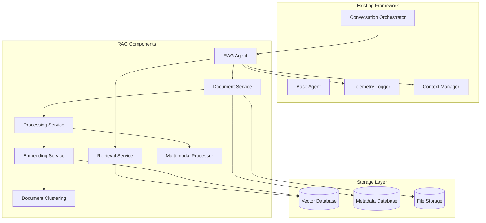

# RAG-Powered Q&A Agent – Design Document

> **Version 1.1 – July 18 2025**
>
> This document outlines the technical design for a Retrieval-Augmented Generation (RAG) system that integrates with the existing agentic conversation framework to enable conversational querying of unstructured documents with detailed source attribution.

---

## 1 Overview

The RAG-powered Q&A agent is designed as a specialized agent within the existing agentic conversation framework. It processes unstructured documents, creates searchable vector embeddings, and provides conversational access to the information with precise source attribution. The system leverages the existing orchestrator, telemetry, and conversation management infrastructure while adding new components for document processing and retrieval.

### 1.1 Key Design Principles

- **Framework Integration**: Leverages existing agentic conversation orchestrator and infrastructure
- **Modular Architecture**: New components integrate seamlessly with existing system
- **Source Transparency**: Every factual statement is traceable to its source document and paragraph
- **Semantic Understanding**: Document clustering and relationship mapping for enhanced retrieval
- **Multi-modal Support**: Handle text, images, charts, and tables within documents
- **Lightweight Design**: Focus on core functionality without unnecessary complexity

## 2 Architecture

### 2.1 High-Level Architecture



### 2.2 Component Responsibilities

| Component | Responsibility |
|-----------|----------------|
| **RAG Agent** | Main agent class extending BaseAgent, handles document queries and conversation flow |
| **Document Service** | File upload, metadata management, document lifecycle |
| **Processing Service** | Text extraction, chunking, preprocessing coordination |
| **Embedding Service** | Vector embedding generation and management |
| **Retrieval Service** | Vector similarity search and ranking |
| **Document Clustering** | Semantic document clustering and relationship mapping |
| **Multi-modal Processor** | Extract and process images, charts, tables from documents |
| **Existing Framework** | Leverages orchestrator, telemetry, context management, and conversation flow |

## 3 Components and Interfaces

### 3.1 RAG Agent Implementation

#### 3.1.1 RAG Agent Class

**Purpose**: Main agent class that extends BaseAgent to handle document queries within the conversation framework.

**Implementation**:
```python
class RAGAgent(BaseAgent):
    def __init__(self, agent_id: str, config: Dict[str, Any]):
        super().__init__(agent_id, config)
        self.document_service = DocumentService(config)
        self.retrieval_service = RetrievalService(config)
        self.embedding_service = EmbeddingService(config)
        self.clustering_service = DocumentClustering(config)
    
    async def process_message(self, message: Message, context: ConversationContext) -> Message:
        """Process document-related queries and return responses with source attribution"""
        pass
```

### 3.2 Document Processing Pipeline

#### 3.2.1 Text Extraction Component

**Purpose**: Extract text content from various document formats while preserving structure.

**Implementation Options**:
- **Primary**: PyPDF2 for PDFs, python-docx for Word documents
- **Advanced**: Azure Document Intelligence (ADI) for high-quality extraction with layout preservation
- **Fallback**: Apache Tika for broader format support

**Interface**:
```python
class DocumentExtractor:
    def extract_text(self, file_path: str, file_type: str) -> ExtractedDocument:
        """Extract text with paragraph and page boundaries preserved"""
        pass
    
    def get_supported_formats(self) -> List[str]:
        """Return list of supported file formats"""
        pass
```

**Output Format**:
```python
@dataclass
class ExtractedDocument:
    document_id: str
    filename: str
    pages: List[PageContent]
    metadata: Dict[str, Any]

@dataclass
class PageContent:
    page_number: int
    paragraphs: List[Paragraph]
    
@dataclass
class Paragraph:
    paragraph_id: str
    text: str
    bounding_box: Optional[BoundingBox]
    style_info: Optional[Dict[str, Any]]
```

#### 3.2.2 Text Chunking Component

**Purpose**: Split extracted text into semantically meaningful chunks for embedding.

**Strategy**: 
- Respect paragraph boundaries from document extraction
- Use sliding window approach for large paragraphs
- Maintain overlap between chunks to preserve context

**Interface**:
```python
class TextChunker:
    def chunk_document(self, document: ExtractedDocument, 
                      chunk_size: int = 512, 
                      overlap: int = 50) -> List[DocumentChunk]:
        """Split document into overlapping chunks"""
        pass
```

#### 3.2.3 Multi-modal Processing Component

**Purpose**: Extract and process images, charts, and tables from documents.

**Implementation**:
```python
class MultiModalProcessor:
    def extract_images(self, document: ExtractedDocument) -> List[ImageChunk]:
        """Extract images with OCR and description generation"""
        pass
    
    def extract_tables(self, document: ExtractedDocument) -> List[TableChunk]:
        """Extract tables and convert to structured format"""
        pass
    
    def extract_charts(self, document: ExtractedDocument) -> List[ChartChunk]:
        """Extract charts and generate descriptions"""
        pass
```

### 3.3 Vector Storage and Retrieval

#### 3.3.1 Embedding Generation

**Primary Option**: OpenAI text-embedding-3-small (1536 dimensions)
**Alternatives**: Sentence-Transformers (all-MiniLM-L6-v2), Cohere embeddings

**Interface**:
```python
class EmbeddingService:
    def generate_embeddings(self, texts: List[str]) -> List[List[float]]:
        """Generate vector embeddings for text chunks"""
        pass
    
    def get_embedding_dimension(self) -> int:
        """Return the dimension of generated embeddings"""
        pass
```

#### 3.3.2 Vector Database

**Primary Options**: 
- **ChromaDB**: Lightweight, good for development and small deployments
- **Pinecone**: Managed, high-performance, good for production
- **Weaviate**: Open-source, self-hosted, rich querying capabilities

#### 3.3.3 Document Clustering Service

**Purpose**: Semantic document clustering and relationship mapping.

**Implementation**:
```python
class DocumentClustering:
    def cluster_documents(self, documents: List[Document]) -> List[DocumentCluster]:
        """Group related documents using semantic similarity"""
        pass
    
    def find_relationships(self, document_id: str) -> List[DocumentRelationship]:
        """Find relationships between documents"""
        pass
    
    def get_cluster_summary(self, cluster_id: str) -> ClusterSummary:
        """Generate summary for document cluster"""
        pass
```

**Interface**:
```python
class VectorStore:
    def upsert_vectors(self, vectors: List[VectorRecord]) -> None:
        """Store or update vector embeddings with metadata"""
        pass
    
    def similarity_search(self, query_vector: List[float], 
                         top_k: int = 10, 
                         filters: Dict = None) -> List[SearchResult]:
        """Retrieve most similar vectors"""
        pass
    
    def delete_document(self, document_id: str) -> None:
        """Remove all vectors for a document"""
        pass
```

### 3.3 Conversational Interface

#### 3.3.1 Query Processing

**Flow**:
1. Receive user question
2. Generate query embedding
3. Retrieve relevant document chunks
4. Rank and filter results
5. Generate response with source attribution

**Interface**:
```python
class ChatService:
    def process_query(self, session_id: str, query: str) -> ChatResponse:
        """Process user query and return response with sources"""
        pass
    
    def create_session(self) -> str:
        """Create new conversation session"""
        pass
    
    def get_conversation_history(self, session_id: str) -> List[Message]:
        """Retrieve conversation history"""
        pass
```

#### 3.3.2 Response Generation

**LLM Integration**:
- **Primary**: OpenAI GPT-4 or GPT-4-turbo
- **Alternatives**: Anthropic Claude, local models via Ollama

**Prompt Strategy**:
```python
SYSTEM_PROMPT = """
You are a helpful assistant that answers questions based on provided document excerpts.
For each factual statement or number in your response, you must cite the source using [SOURCE_ID].
Only use information from the provided context. If you cannot find relevant information, say so clearly.
"""

def build_prompt(query: str, context_chunks: List[DocumentChunk]) -> str:
    """Build prompt with query and retrieved context"""
    pass
```

#### 3.3.3 Source Attribution

**Strategy**: 
- Parse LLM response to identify factual statements
- Map citations back to source chunks
- Provide interactive citation bubbles in UI

**Data Structure**:
```python
@dataclass
class ChatResponse:
    content: str
    sources: List[SourceCitation]
    confidence_score: float
    
@dataclass
class SourceCitation:
    citation_id: str
    document_name: str
    chunk_id: str
    page_number: int
    paragraph_number: int
    excerpt: str
    relevance_score: float
```

## 4 Data Models

### 4.1 Core Entities

#### Document Entity
```python
class Document(BaseModel):
    document_id: str = Field(..., description="Unique document identifier")
    filename: str
    file_size: int
    content_type: str
    upload_date: datetime
    processing_status: ProcessingStatus
    chunk_count: int = 0
    metadata: Dict[str, Any] = {}

class ProcessingStatus(Enum):
    UPLOADED = "uploaded"
    PROCESSING = "processing"
    COMPLETED = "completed"
    FAILED = "failed"
```

#### Document Chunk Entity
```python
class DocumentChunk(BaseModel):
    chunk_id: str
    document_id: str
    content: str
    chunk_index: int
    page_number: Optional[int]
    paragraph_number: Optional[int]
    embedding: Optional[List[float]]
    metadata: ChunkMetadata

class ChunkMetadata(BaseModel):
    word_count: int
    section_title: Optional[str]
    bounding_box: Optional[BoundingBox]
    extraction_confidence: Optional[float]
```

#### Conversation Entity
```python
class ConversationSession(BaseModel):
    session_id: str
    created_at: datetime
    last_activity: datetime
    messages: List[Message]

class Message(BaseModel):
    message_id: str
    role: MessageRole
    content: str
    timestamp: datetime
    sources: List[SourceCitation] = []

class MessageRole(Enum):
    USER = "user"
    ASSISTANT = "assistant"
```

### 4.2 Database Schema

#### Metadata Database (PostgreSQL/SQLite)
```sql
-- Documents table
CREATE TABLE documents (
    document_id UUID PRIMARY KEY,
    filename VARCHAR(255) NOT NULL,
    file_size BIGINT NOT NULL,
    content_type VARCHAR(100) NOT NULL,
    upload_date TIMESTAMP NOT NULL,
    processing_status VARCHAR(20) NOT NULL,
    chunk_count INTEGER DEFAULT 0,
    metadata JSONB
);

-- Document chunks table
CREATE TABLE document_chunks (
    chunk_id UUID PRIMARY KEY,
    document_id UUID REFERENCES documents(document_id) ON DELETE CASCADE,
    content TEXT NOT NULL,
    chunk_index INTEGER NOT NULL,
    page_number INTEGER,
    paragraph_number INTEGER,
    metadata JSONB,
    created_at TIMESTAMP DEFAULT NOW()
);

-- Conversation sessions table
CREATE TABLE conversation_sessions (
    session_id UUID PRIMARY KEY,
    created_at TIMESTAMP NOT NULL,
    last_activity TIMESTAMP NOT NULL
);

-- Messages table
CREATE TABLE messages (
    message_id UUID PRIMARY KEY,
    session_id UUID REFERENCES conversation_sessions(session_id) ON DELETE CASCADE,
    role VARCHAR(20) NOT NULL,
    content TEXT NOT NULL,
    timestamp TIMESTAMP NOT NULL,
    sources JSONB
);
```

## 5 Error Handling

### 5.1 Document Processing Errors

**Error Categories**:
- Unsupported file format
- Corrupted or encrypted files
- Extraction service failures
- Embedding generation failures

**Handling Strategy**:
```python
class DocumentProcessingError(Exception):
    def __init__(self, document_id: str, stage: str, message: str):
        self.document_id = document_id
        self.stage = stage
        self.message = message

class ErrorHandler:
    def handle_processing_error(self, error: DocumentProcessingError) -> None:
        # Log error details
        # Update document status
        # Notify user if necessary
        # Implement retry logic for transient failures
        pass
```

### 5.2 Query Processing Errors

**Error Categories**:
- Vector database unavailable
- LLM service failures
- Context window exceeded
- No relevant documents found

**Graceful Degradation**:
- Fallback to keyword search if vector search fails
- Use cached responses for repeated queries
- Provide partial results with confidence indicators

## 6 Testing Strategy

### 6.1 Unit Testing

**Components to Test**:
- Document extraction accuracy
- Chunking strategy effectiveness
- Embedding generation consistency
- Source attribution accuracy

**Test Data**:
- Sample documents in various formats
- Known question-answer pairs
- Edge cases (empty documents, special characters)

### 6.2 Integration Testing

**End-to-End Scenarios**:
1. Upload document → Process → Query → Verify sources
2. Multi-document queries with cross-references
3. Conversation context maintenance
4. Error recovery scenarios

### 6.3 Performance Testing

**Metrics to Measure**:
- Document processing time vs file size
- Query response time vs document corpus size
- Embedding generation throughput
- Vector search latency

**Load Testing**:
- Concurrent document uploads
- Simultaneous user queries
- Large document corpus performance

## 7 Deployment Architecture

### 7.1 Container Strategy

**Services**:
- `rag-api`: FastAPI backend service
- `rag-processor`: Document processing worker
- `rag-frontend`: React/Next.js web interface

**Docker Compose Example**:
```yaml
version: '3.8'
services:
  rag-api:
    build: ./backend
    environment:
      - DATABASE_URL=postgresql://user:pass@db:5432/ragdb
      - VECTOR_DB_URL=http://weaviate:8080
    depends_on:
      - db
      - weaviate
  
  rag-processor:
    build: ./processor
    environment:
      - QUEUE_URL=redis://redis:6379
    depends_on:
      - redis
  
  rag-frontend:
    build: ./frontend
    ports:
      - "3000:3000"
    environment:
      - NEXT_PUBLIC_API_URL=http://rag-api:8000
```

### 7.2 Scalability Considerations

**Horizontal Scaling**:
- API service: Load balancer + multiple instances
- Processing service: Queue-based worker pool
- Vector database: Sharding by document collection

**Vertical Scaling**:
- GPU acceleration for embedding generation
- Memory optimization for large document processing
- SSD storage for vector database performance

---

**End of Design Document**