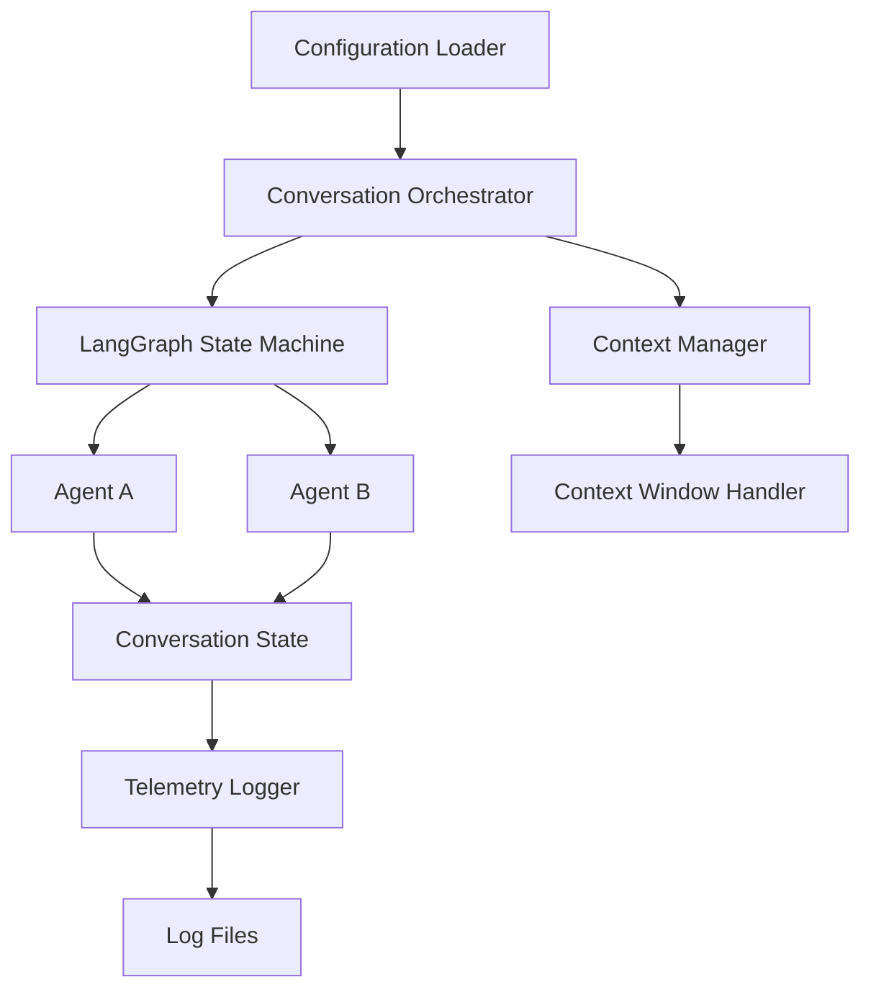
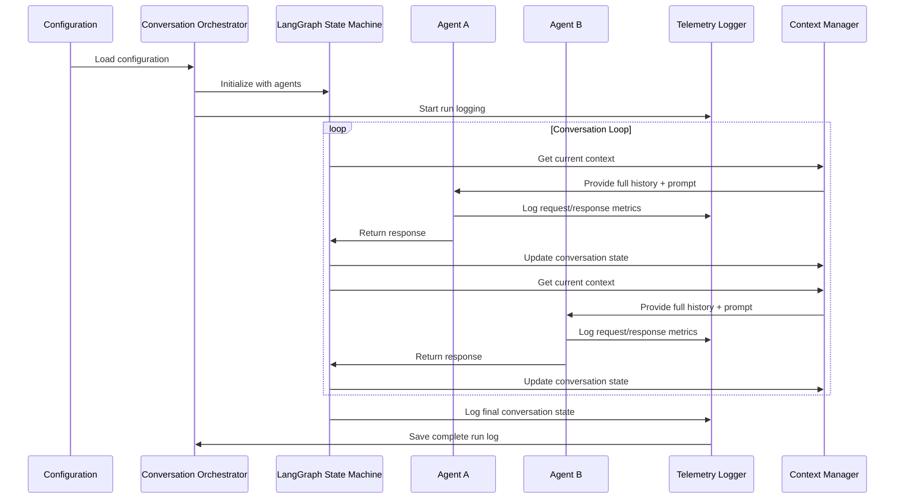

# Design Document

## Overview

The Agentic Conversation System is designed as a Python application that orchestrates sequential dialogue between two AI agents using LangGraph for state management and conversation flow control. The system maintains complete conversation history, provides comprehensive telemetry, and supports flexible configuration through a single YAML configuration file.

The architecture follows a modular design with clear separation of concerns: configuration management, agent orchestration, conversation state management, and telemetry logging. LangGraph's state machine capabilities will manage the conversation flow, while custom agent implementations handle the AI interactions.

## Architecture

### High-Level Architecture



### Component Interaction Flow



## Components and Interfaces

### 1. Configuration Management

**ConfigurationLoader**
- Loads and validates YAML configuration file
- Provides typed configuration objects to other components
- Handles configuration validation and error reporting

```python
@dataclass
class AgentConfig:
    name: str
    system_prompt: str
    
@dataclass
class ModelConfig:
    model_name: str
    temperature: float
    max_tokens: int
    
@dataclass
class ConversationConfig:
    max_turns: int
    initial_prompt: Optional[str]
    context_window_strategy: str  # "truncate", "summarize", "sliding"
    
@dataclass
class SystemConfig:
    agent_a: AgentConfig
    agent_b: AgentConfig
    model: ModelConfig
    conversation: ConversationConfig
    logging: LoggingConfig
```

### 2. Agent Implementation

**BaseAgent (Abstract)**
- Defines the interface for agent implementations
- Handles LLM interactions and response generation
- Manages agent-specific configuration and state

**LangChainAgent (Concrete)**
- Implements BaseAgent using LangChain patterns
- Integrates with various LLM providers
- Handles retry logic and error recovery

```python
class BaseAgent(ABC):
    @abstractmethod
    async def generate_response(self, conversation_history: List[Message], context: ConversationContext) -> AgentResponse
    
    @abstractmethod
    def get_agent_info(self) -> AgentInfo
```

### 3. Conversation State Management

**ConversationState**
- Maintains the complete conversation history
- Tracks turn count, timestamps, and metadata
- Provides context window management

**ContextManager**
- Handles context window limitations with real-time token counting
- Implements truncation, summarization, or sliding window strategies
- Ensures agents receive appropriate context within token limits
- Tracks and reports current context window utilization at each step

```python
@dataclass
class Message:
    agent_id: str
    content: str
    timestamp: datetime
    token_count: int
    metadata: Dict[str, Any]
    
@dataclass
class ConversationState:
    messages: List[Message]
    current_turn: int
    start_time: datetime
    status: ConversationStatus
    current_context_tokens: int
    max_context_tokens: int
```

### 4. LangGraph State Machine

**ConversationGraph**
- Defines the conversation flow using LangGraph
- Manages agent turn transitions
- Handles termination conditions and error states

```python
# LangGraph state definition
class GraphState(TypedDict):
    conversation_state: ConversationState
    current_agent: str
    should_continue: bool
    error_state: Optional[str]
```

### 5. Telemetry and Logging

**TelemetryLogger**
- Captures comprehensive metrics for each conversation run
- Logs agent interactions, performance data, and errors
- Provides structured logging output

**RunLogger**
- Manages individual conversation run logs
- Aggregates telemetry data and conversation history
- Exports logs in multiple formats (JSON, CSV)

```python
@dataclass
class AgentMetrics:
    response_time: float
    token_count: int
    model_calls: int
    errors: List[str]
    
@dataclass
class ContextWindowSnapshot:
    turn_number: int
    total_tokens: int
    available_tokens: int
    utilization_percentage: float
    strategy_applied: Optional[str]  # "truncate", "summarize", etc.
    
@dataclass
class RunTelemetry:
    run_id: str
    start_time: datetime
    end_time: datetime
    total_turns: int
    agent_metrics: Dict[str, AgentMetrics]
    conversation_history: List[Message]
    context_window_snapshots: List[ContextWindowSnapshot]
    configuration: SystemConfig
```

## Data Models

### Core Data Structures

**Message Model**
- Represents individual agent messages
- Includes metadata for telemetry and analysis
- Supports rich content types (text, structured data)

**Agent Response Model**
- Encapsulates agent responses with metadata
- Includes confidence scores and reasoning traces
- Supports error states and retry information

**Conversation Context Model**
- Provides agents with relevant conversation context
- Handles context window management
- Includes agent-specific context filtering

### Configuration Schema

```yaml
# config.yaml
agents:
  agent_a:
    name: "Researcher"
    system_prompt: "You are a thorough researcher who asks probing questions..."
  agent_b:
    name: "Analyst"
    system_prompt: "You are an analytical thinker who synthesizes information..."

model:
  model_name: "gpt-4"
  temperature: 0.7
  max_tokens: 2000

conversation:
  max_turns: 20
  initial_prompt: "Discuss the implications of artificial intelligence in education"
  context_window_strategy: "sliding"
  context_window_size: 8000

logging:
  log_level: "INFO"
  output_directory: "./logs"
  real_time_display: true
  export_formats: ["json", "csv"]
```

## Error Handling

### Error Categories

1. **Configuration Errors**
   - Invalid configuration file format
   - Missing required configuration fields
   - Invalid parameter values

2. **Agent Errors**
   - LLM API failures
   - Network connectivity issues
   - Response parsing errors

3. **Context Management Errors**
   - Context window overflow
   - Memory allocation issues
   - State corruption

4. **System Errors**
   - File I/O errors
   - Logging failures
   - Resource exhaustion

### Error Recovery Strategies

**Retry Logic**
- Exponential backoff for transient failures
- Maximum retry limits to prevent infinite loops
- Circuit breaker pattern for persistent failures

**Graceful Degradation**
- Context window fallback strategies
- Simplified prompts for error recovery
- Safe conversation termination

**Error Reporting**
- Structured error logging with context
- Error aggregation and analysis
- User-friendly error messages

## Testing Strategy

### Unit Testing

**Component Testing**
- Configuration loader validation
- Agent response generation
- Context management logic
- Telemetry data collection

**Mock Testing**
- LLM API interactions
- File system operations
- Network requests

### Integration Testing

**End-to-End Scenarios**
- Complete conversation flows
- Error recovery scenarios
- Configuration variations

**Performance Testing**
- Context window management under load
- Memory usage optimization
- Response time benchmarks

### Test Data Management

**Conversation Fixtures**
- Predefined conversation scenarios
- Edge case test data
- Performance benchmark data

**Configuration Test Cases**
- Valid configuration variations
- Invalid configuration scenarios
- Boundary condition testing

## Performance Considerations

### Memory Management

**Context Window Optimization**
- Efficient message storage and retrieval
- Memory-conscious context truncation
- Garbage collection for completed conversations

**State Management**
- Minimal state persistence
- Efficient state transitions
- Memory leak prevention

### Scalability

**Concurrent Conversations**
- Support for multiple simultaneous conversations
- Resource isolation between conversations
- Shared resource management

**Extensibility**
- Plugin architecture for new agent types
- Configurable LLM providers
- Modular component design

### Monitoring

**Performance Metrics**
- Response time tracking
- Memory usage monitoring
- Error rate analysis

**Resource Usage**
- Token consumption tracking
- API rate limit management
- Cost optimization insights