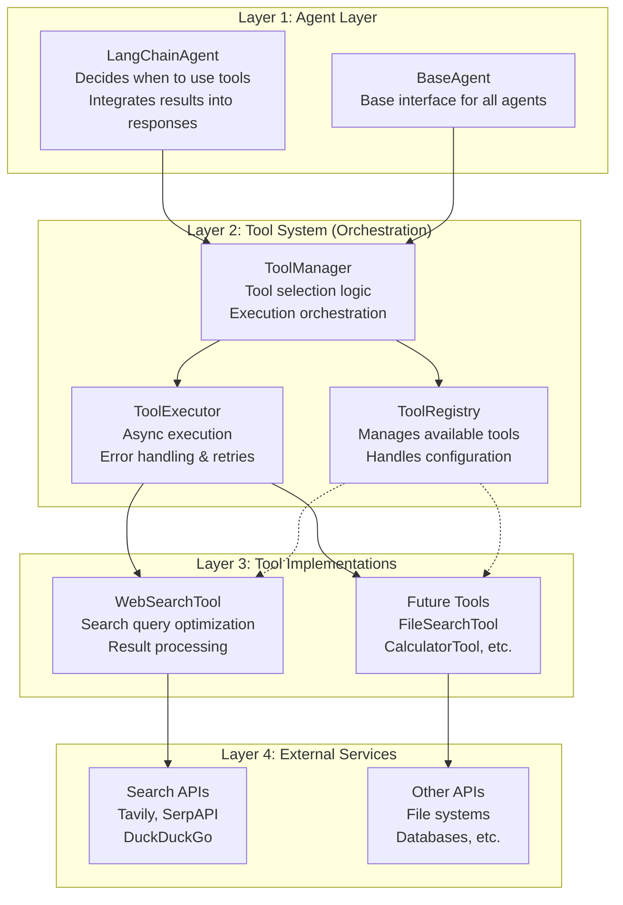

# Design Document

## Overview

This design implements a modular tool system for the agentic conversation system, enabling agents to autonomously use external tools like web search. The architecture prioritizes extensibility, allowing easy addition of new tools while maintaining clean separation between tool logic and agent logic.

The system introduces a tool registry, standardized tool interfaces, and agent-driven tool selection mechanisms. Agents will evaluate conversation context to determine when tools are beneficial, execute them autonomously, and integrate results naturally into their responses.

## Architecture

### High-Level Architecture

The architecture consists of four distinct layers, each with specific responsibilities:

#### Layer 1: Agent Layer

- **Purpose**: The existing agent implementations that generate conversation responses
- **Components**: `LangChainAgent`, `BaseAgent`
- **Responsibility**: Decides when tools might be useful and integrates tool results into responses

#### Layer 2: Tool System (Orchestration Layer)

- **Purpose**: Provides a unified interface between agents and tools, handling the complexity of tool management
- **Components**:
  - `ToolRegistry`: Discovers, registers, and manages available tools
  - `ToolManager`: High-level interface for agents - decides which tools to use and orchestrates execution
  - `ToolExecutor`: Low-level execution engine - handles timeouts, retries, rate limiting, and error handling
- **Responsibility**: Abstracts tool complexity from agents, provides consistent interfaces, and manages execution policies

#### Layer 3: Tool Implementations (Concrete Tools)

- **Purpose**: Specific tool implementations that perform actual work (web search, file operations, etc.)
- **Components**: `WebSearchTool`, future tools like `FileSearchTool`, `CalculatorTool`, etc.
- **Responsibility**: Implements the `BaseTool` interface, handles tool-specific logic, and communicates with external services

#### Layer 4: External Services

- **Purpose**: Third-party APIs and services that tools interact with
- **Components**: Search APIs (Tavily, SerpAPI), file systems, databases, etc.
- **Responsibility**: Provides the actual functionality that tools wrap and expose to the system



#### Key Architectural Benefits:

1. **Separation of Concerns**: Agents focus on conversation logic, tools focus on specific capabilities
2. **Extensibility**: New tools can be added without modifying existing agents or the tool system
3. **Consistency**: All tools follow the same interface and execution patterns
4. **Reliability**: Centralized error handling, retries, and resource management
5. **Configurability**: Tools can be enabled/disabled per agent through configuration

### Core Components

#### 1. Tool Interface (`BaseTool`)

Abstract base class defining the standard interface for all tools:

- `execute()`: Main execution method
- `validate_input()`: Input validation
- `get_tool_info()`: Metadata about the tool
- `is_relevant()`: Context-based relevance evaluation

#### 2. Tool Registry (`ToolRegistry`)

Central registry managing available tools:

- Tool discovery and registration
- Configuration validation
- Tool instantiation and lifecycle management
- Capability querying

#### 3. Tool Manager (`ToolManager`)

High-level interface for agents to interact with tools:

- Tool selection based on context
- Execution orchestration
- Result processing and formatting
- Error handling and fallbacks

#### 4. Tool Executor (`ToolExecutor`)

Low-level execution engine:

- Async tool execution with timeouts
- Resource management and throttling
- Retry logic and circuit breakers
- Telemetry collection

## Components and Interfaces

### Tool Interface Design

```python
@dataclass
class ToolResult:
    """Standardized tool execution result"""
    success: bool
    content: str
    metadata: Dict[str, Any]
    execution_time: float
    token_count: int
    errors: List[str]

@dataclass
class ToolContext:
    """Context provided to tools for execution"""
    conversation_history: List[Message]
    current_turn: int
    agent_id: str
    available_tokens: int
    metadata: Dict[str, Any]

class BaseTool(ABC):
    """Abstract base class for all tools"""

    @abstractmethod
    async def execute(self, query: str, context: ToolContext) -> ToolResult:
        """Execute the tool with given query and context"""
        pass

    @abstractmethod
    def is_relevant(self, context: ToolContext) -> bool:
        """Determine if this tool is relevant for the current context"""
        pass

    @abstractmethod
    def get_tool_info(self) -> ToolInfo:
        """Get metadata about this tool"""
        pass
```

### Web Search Tool Implementation

```python
class WebSearchTool(BaseTool):
    """Web search tool implementation"""

    def __init__(self, config: WebSearchConfig):
        self.config = config
        self.search_client = self._create_search_client()
        self.rate_limiter = RateLimiter(config.rate_limit)

    async def execute(self, query: str, context: ToolContext) -> ToolResult:
        """Execute web search and return processed results"""
        # Query optimization based on context
        optimized_query = self._optimize_query(query, context)

        # Execute search with rate limiting
        async with self.rate_limiter:
            raw_results = await self.search_client.search(optimized_query)

        # Process and summarize results
        processed_results = self._process_results(raw_results, context)

        return ToolResult(
            success=True,
            content=processed_results,
            metadata={"query": optimized_query, "result_count": len(raw_results)},
            execution_time=time.time() - start_time,
            token_count=self._count_tokens(processed_results),
            errors=[]
        )

    def is_relevant(self, context: ToolContext) -> bool:
        """Determine if web search is relevant based on conversation context"""
        # Analyze recent messages for indicators of need for current information
        recent_messages = context.conversation_history[-3:]

        # Look for temporal indicators, factual questions, current events
        relevance_indicators = [
            "current", "latest", "recent", "today", "now", "2024", "2025",
            "what is", "how many", "statistics", "data", "research"
        ]

        for message in recent_messages:
            content_lower = message.content.lower()
            if any(indicator in content_lower for indicator in relevance_indicators):
                return True

        return False
```

### Tool Manager Integration

```python
class ToolManager:
    """Manages tool selection and execution for agents"""

    def __init__(self, registry: ToolRegistry):
        self.registry = registry
        self.executor = ToolExecutor()

    async def evaluate_and_execute_tools(
        self,
        context: ToolContext
    ) -> List[ToolResult]:
        """Evaluate which tools to use and execute them"""

        # Get available tools for the agent
        available_tools = self.registry.get_tools_for_agent(context.agent_id)

        # Filter tools by relevance
        relevant_tools = [
            tool for tool in available_tools
            if tool.is_relevant(context)
        ]

        if not relevant_tools:
            return []

        # Select best tool(s) based on context and constraints
        selected_tools = self._select_tools(relevant_tools, context)

        # Execute selected tools
        results = []
        for tool in selected_tools:
            query = self._generate_query(tool, context)
            result = await self.executor.execute_tool(tool, query, context)
            results.append(result)

        return results
```

### Agent Integration

The `LangChainAgent` will be extended to integrate with the tool system:

```python
class LangChainAgent(BaseAgent):
    def __init__(self, ..., tool_manager: Optional[ToolManager] = None):
        # Existing initialization
        self.tool_manager = tool_manager

    async def generate_response(self, context: ConversationContext) -> AgentResponse:
        """Enhanced response generation with tool support"""

        # Check if tools should be used
        tool_results = []
        if self.tool_manager:
            tool_context = self._create_tool_context(context)
            tool_results = await self.tool_manager.evaluate_and_execute_tools(tool_context)

        # Integrate tool results into context
        enhanced_context = self._integrate_tool_results(context, tool_results)

        # Generate response with enhanced context
        response = await self._generate_response_with_context(enhanced_context)

        # Add tool metadata to response
        if tool_results:
            response.metadata["tool_usage"] = [
                {"tool": result.metadata.get("tool_name"),
                 "execution_time": result.execution_time}
                for result in tool_results
            ]

        return response
```

## Data Models

### Tool Configuration Models

```python
@dataclass
class ToolConfig:
    """Base configuration for tools"""
    name: str
    enabled: bool = True
    timeout: float = 30.0
    max_retries: int = 3
    metadata: Dict[str, Any] = field(default_factory=dict)

@dataclass
class WebSearchConfig(ToolConfig):
    """Configuration for web search tool"""
    provider: str = "tavily"  # tavily, serpapi, duckduckgo
    api_key: Optional[str] = None
    max_results: int = 5
    rate_limit: int = 10  # requests per minute
    result_summary_length: int = 200
    relevance_threshold: float = 0.7

@dataclass
class AgentToolConfig:
    """Tool configuration for individual agents"""
    enabled_tools: List[str] = field(default_factory=list)
    tool_configs: Dict[str, ToolConfig] = field(default_factory=dict)
    max_concurrent_tools: int = 2
    tool_timeout: float = 45.0
```

### Enhanced System Configuration

The existing configuration system will be extended to support tools:

```python
@dataclass
class SystemConfig:
    """Extended system configuration with tool support"""
    agent_a: AgentConfig
    agent_b: AgentConfig
    model: ModelConfig
    conversation: ConversationConfig
    logging: LoggingConfig
    tools: ToolSystemConfig  # New section

@dataclass
class ToolSystemConfig:
    """Tool system configuration"""
    enabled: bool = True
    registry_config: Dict[str, Any] = field(default_factory=dict)
    default_timeout: float = 30.0
    max_concurrent_executions: int = 5
    tool_configs: Dict[str, ToolConfig] = field(default_factory=dict)
    agent_tool_mappings: Dict[str, AgentToolConfig] = field(default_factory=dict)
```

## Error Handling

### Error Hierarchy

```python
class ToolError(Exception):
    """Base exception for tool-related errors"""
    pass

class ToolExecutionError(ToolError):
    """Raised when tool execution fails"""
    pass

class ToolTimeoutError(ToolError):
    """Raised when tool execution times out"""
    pass

class ToolConfigurationError(ToolError):
    """Raised when tool configuration is invalid"""
    pass

class ToolRateLimitError(ToolError):
    """Raised when rate limits are exceeded"""
    pass
```

### Error Handling Strategy

1. **Graceful Degradation**: Agents continue functioning when tools fail
2. **Circuit Breaker Pattern**: Temporarily disable failing tools
3. **Retry Logic**: Configurable retry attempts with exponential backoff
4. **Fallback Mechanisms**: Alternative tools or manual processing
5. **Error Reporting**: Comprehensive logging and telemetry

## Testing Strategy

### Unit Testing

- Individual tool implementations
- Tool registry and manager components
- Configuration validation
- Error handling scenarios

### Integration Testing

- End-to-end tool usage in conversations
- Agent-tool interaction patterns
- Configuration loading and validation
- Performance under load

### Mock Testing

- External API mocking for reliable tests
- Tool result simulation
- Network failure scenarios
- Rate limiting behavior

### Performance Testing

- Tool execution latency
- Concurrent tool usage
- Memory usage patterns
- Token consumption tracking

## Security Considerations

### API Key Management

- Secure storage using environment variables or key management systems
- Rotation and expiration handling
- Audit logging for key usage

### Query Sanitization

- Remove sensitive information from search queries
- Validate and sanitize tool inputs
- Prevent injection attacks

### Result Validation

- Sanitize tool results before integration
- Validate result formats and content
- Filter potentially harmful content

### Network Security

- Use HTTPS for all external API calls
- Implement proper certificate validation
- Configure appropriate timeouts and limits

## Performance Optimization

### Caching Strategy

- Cache search results for common queries
- Implement TTL-based cache expiration
- Use conversation context for cache keys

### Resource Management

- Connection pooling for HTTP clients
- Async execution to prevent blocking
- Resource cleanup and garbage collection

### Token Optimization

- Summarize tool results to fit context windows
- Prioritize most relevant information
- Track and optimize token usage

## Monitoring and Observability

### Metrics Collection

- Tool execution times and success rates
- API usage and rate limiting
- Token consumption by tool type
- Error rates and failure patterns

### Logging Strategy

- Structured logging for tool operations
- Debug information for troubleshooting
- Performance metrics and trends
- Security audit trails

### Telemetry Integration

- Extend existing telemetry system
- Tool usage in conversation exports
- Performance dashboards and alerts
- Cost tracking for paid APIs
